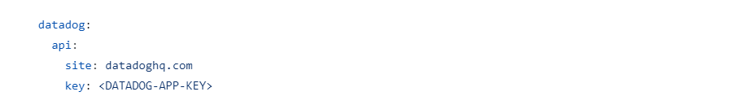
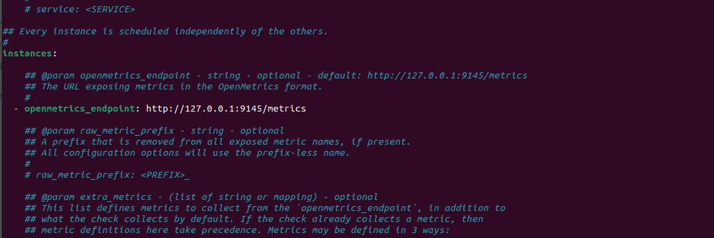
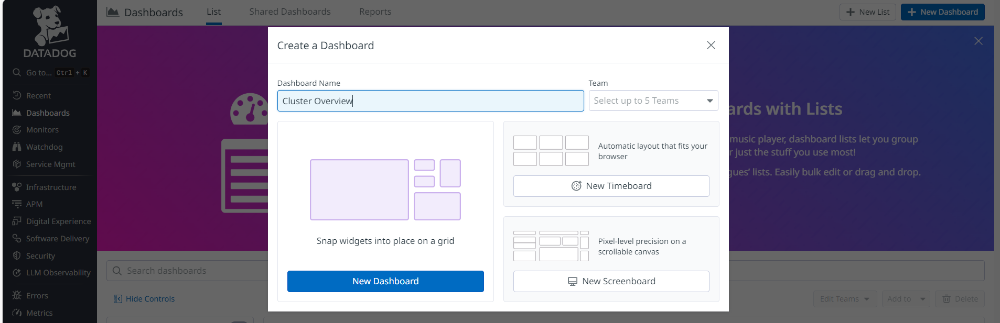
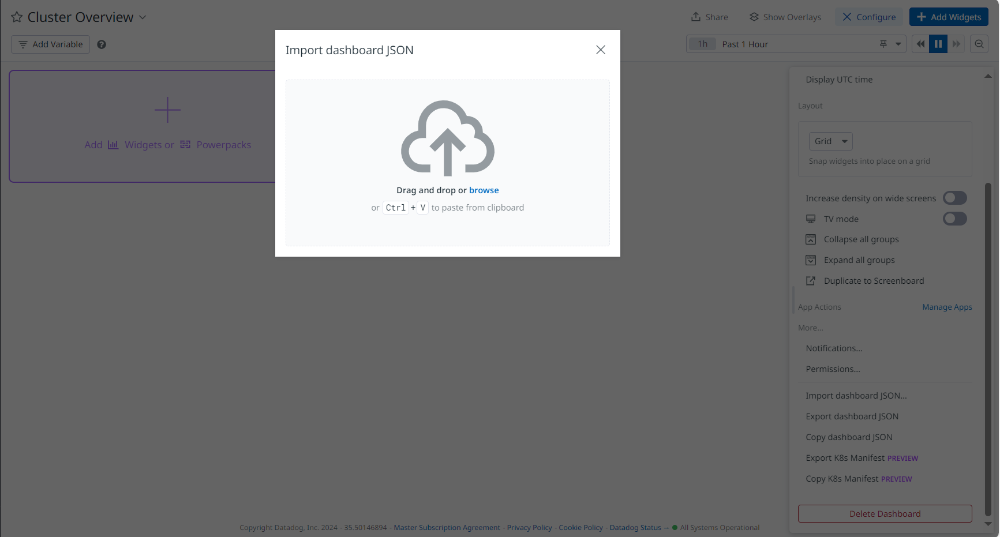

# 
# Aerospike Monitoring with Datadog via OpenTelemetry Collector

This guide outlines the steps required to set up **Aerospike monitoring with Datadog** using the **OpenTelemetry Collector (otel-collector)** and **Datadog Agent**. It covers the installation and configuration of both components to ensure metrics from Aerospike are properly sent to Datadog for monitoring.

## Prerequisites

Before starting, make sure you have the following:

- **Aerospike Cluster**: Your Aerospike cluster must be running, and you need access to the Aerospike server.
- **Datadog Account**: A Datadog account to collect and visualize metrics.
- **Docker** (optional): You can run the OpenTelemetry Collector and Datadog Agent in Docker containers.

---

## Setup Instructions

### Step 1: Clone the Aerospike Monitoring Repository

Clone the Aerospike monitoring repository to your local machine:

```bash
git clone https://github.com/aerospike/aerospike-monitoring.git
cd examples/otel
```

### Step 2: Configure Docker Compose and OpenTelemetry Collector

#### datadog-docker-compose.yml
The [datadog-docker-compose.yml](../../examples/otel/datadog-docker-compose.yml) file contains services such as `aerospike-prometheus-exporter` and `otel-collector` that require specific environment configurations and volume mounts.

#### datadog-otel-collector-config.yml
The [datadog-otel-collector-config.yml](../../examples/otel/datadog-otel-collector-config.yml) configures the OpenTelemetry Collector with receivers, processors, exporters, and service pipelines for handling traces.

**Important:** Update the `datadog-api-site` and `datadog-api-key` in this configuration file to match your Datadog account details.


### Step 3: Run the Docker Compose Command

Once the configurations are updated, start the services using Docker Compose:

```bash
docker-compose -f datadog-docker-compose.yml up -d
```

---

## Integrating Datadog Agent with Aerospike Prometheus Exporter

### Step 1: Navigate to Datadog Agent Configuration Directory

Navigate to the Datadog Agent's configuration directory for Aerospike integration:

```bash
cd /etc/datadog-agent/conf.d/aerospike
```

### Step 2: Copy the Example Configuration File

Copy the example configuration file to `conf.yaml`:

```bash
cp conf.yaml.example conf.yaml
```

### Step 3: Update the OpenMetrics Endpoint

Edit the `conf.yaml` file to update the `openmetrics_endpoint` with the IP address or container name of your **Aerospike Prometheus exporter**. This configuration tells the Datadog Agent where to scrape metrics from the Prometheus exporter.

```yaml
openmetrics_endpoint: "http://<AEROSPIKE_PROMETHEUS_EXPORTER_IP>:9145/metrics"
```


---

## Importing Dashboards into Datadog UI
Datadog allows you to import predefined or custom dashboards into the UI. Follow the steps below to import your Aerospike monitoring dashboards into Datadog.

### Step 1: Log in to Datadog

Open your web browser and log in to your **Datadog** account.

### Step 2: Navigate to Dashboards

In the Datadog UI, click on the **"Dashboards"** tab located in the left-hand sidebar. Then, click the **"New Dashboard"** button at the top-right of the page.



### Step 3: Import the Dashboard JSON

In the **"New Dashboard"** screen, click on the **"Configure"** option on the top-right side and select **Import Dashboard JSON**.

- Copy the contents of your dashboard JSON file and paste it, or drag the JSON file into the field.
- Click **"Import"** to load the dashboard.
  

---

## Creating Monitors/Alerts in Datadog

To create Monitors/Alerts in Datadog, you can use the provided **Python script**. This script reads multiple monitor configurations from a JSON file and creates monitors via the **Datadog API**.

### Prerequisites

- **Datadog API Key** and **Application Key** are required.
- Python must be installed on your machine.

### Steps to Create Monitors

The `datadog_monitors_creation.py` script reads alert rules from a JSON file and creates corresponding monitors in Datadog using the Datadog API.

#### Important

- `api_key` and `app_key`: During runtime, you will be prompted to enter your actual Datadog API Key and Datadog Application Key.
- `datadog_site`: During runtime, you will also be prompted to enter the Datadog site where your account is hosted (e.g., `datadoghq.com`, `us5.datadoghq.com`).
- `aerospike_datadog_monitors.json`: This JSON file contains multiple monitor configurations, such as monitor name, type, query, and message.
- Make sure to adjust the **thresholds** according to your requirements.

### Run the Python Script

After updating the necessary configurations, run the script using the following command:

```bash
python3 datadog_monitors_creation.py
```
---

## Useful Links

- [Aerospike Monitoring GitHub Repository](https://github.com/aerospike/aerospike-monitoring)
- [Datadog Official Documentation](https://docs.datadoghq.com/)
- [OpenTelemetry Collector Documentation](https://opentelemetry.io/docs/)

---

## Troubleshooting

If you encounter issues, verify the following:

- Ensure all environment variables and API keys are correctly set.
- Check that the Docker containers are running and that the services are properly connected.
- Review logs for the OpenTelemetry Collector and Datadog Agent for any errors or warnings.

If you need further assistance, refer to the **Datadog Support** and **Aerospike Community** for troubleshooting guidance.
