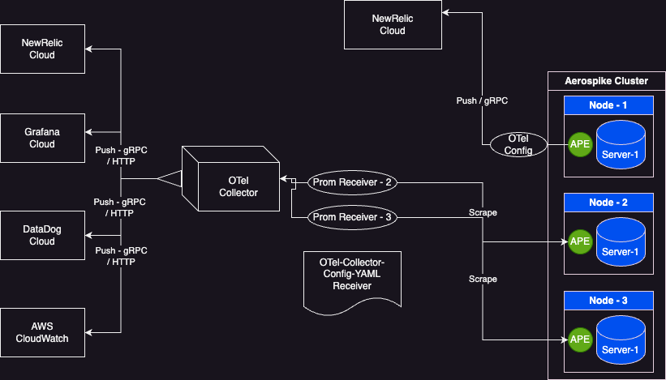

# OTel Aerospike Monitoring Stack

The otel deploy Aerospike Monitoring Stack is a docker compose configuration
which creates the following containers running on the same host as a single-node
Aerospike cluster:
1. aerospike-prometheus-exporter latest version
2. OTel collector contrib latest version

A prerequisite is that you have a single-node cluster, with the service port
accessible from port 3000 of the host where the monitoring stack is deployed.  If you
do not already have such an Aerospike cluster, you can deploy a single-node cluster
in a container using:

```
$ docker run -tid --name aerospike -p 3000:3000 -p 3001:3001 -p 3002:3002 aerospike/aerospike-server:latest
```

# Deployment model

Aerospike Prometheus Exporter can push data to OTel endpoints  

1. Exporter directly pushing to OTel endpoint
2. OTel Collector

# Connecting to OTel endpoints


## Aerospike Prometheus Exporter push to OTel endpoint
##### Modify the Aerospike Prometheus Exporter ape.toml config file with the OTel endpoints

> **Note**: Currently Exporter supports only gRPC endpoints

OpenTelemetry configs are available under section Agent.OpenTelemetry in ape.toml config file

```
service_name = "<please provide application service to be appeared in the observability site>"
Example: "aerospike-cluster-checkout-system"
```

```
endpoint = "<endpoint of the OTel provider without any protocol and port number>"
Example: "otlp.nr-data.net"
```

```
endpoint_tls_enabled = true/false
```

```
headers = {<mention the auth api-key as key=value pair here, multiple key/values can be provided as a comma separated values>}
Example: {api-key="newrelic-auth-key"}
```

These examples cover integration of aerospike monitoring with using OTel Collector component

1. NewRelic
2. Datadog
3. AWS Cloudwatch
4. Dynatrace

> **Note**: You need to update the API Key or Access Key in the respective configuration files.

## NewRelic 
### modify newrelic-otel-collector-config.yml and update below key with respective values 
###### <NEWRELIC-API-KEY> 
### To start the stack 
```
$ docker-compose -f newrelic-docker-compose.yml up
```
## To stop the stack
```
$ docker-compose -f newrelic-docker-compose.yml down
```
Now simply point your browser at NewRelic cloud https://one.newrelic.com/data-explorer to see Aerospike metrics.

## Datadog
### modify datadog-otel-collector-config.yml and update below key with respective values 
###### <DATADOG-APP-KEY> 
### To start the stack 
```
$ docker-compose -f datadog-docker-compose.yml up
```

## To stop the stack
```
$ docker-compose -f datadog-docker-compose.yml down
```
Now simply point your browser at Datadog cloud https://app.datadoghq.com/metric/explorer to see Aerospike metrics.

## DynaTrace 
### modify dynatrace-otel-collector-config.yml and update below key with respective values 
###### <DYNATRACE-API-TOKEN> 
### To start the stack 
```
$ docker-compose -f dynatrace-docker-compose.yml up
```
## To stop the stack
```
$ docker-compose -f dynatrace-docker-compose.yml down
```
Now simply point your browser at DynaTrace cloud https://<YOUR-ENVIRONMENT-ID>.apps.dynatrace.com/ui/apps/dynatrace.classic.metrics/ui/metrics to see Aerospike metrics.

See [OTel-DynaTrace-documentation](https://github.com/open-telemetry/opentelemetry-collector-contrib/blob/main/exporter/dynatraceexporter/README.md)

## Cloudwatch
### modify cloudwatch-docker-compose.yml and update below keys with respective values 
###### AWS_REGION=<AWS_REGION_LOCATION>
###### AWS_ACCESS_KEY_ID=<MENTION-YOUR-AWS-CLOUD-WATCH-KEY>
###### AWS_SECRET_ACCESS_KEY=<MENTION-YOUR-AWS-CW-SECRET-ACCESS-KEY>
### To start the stack 
```
$ docker-compose -f cloudwatch-docker-compose.yml up
```

Now simply point your browser at AWS Cloudwatch to see Aerospike metrics.

## To stop the stack
```
$ docker-compose -f cloudwatch-docker-compose.yml down
```
